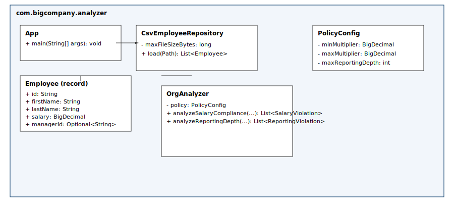
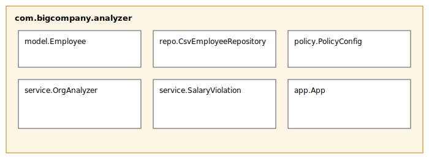

# BigCompany Org Analyzer

This is a complete Maven project (Java 17) that analyzes a CSV of employees and reports:
- Salary compliance violations (managers paid below/above expected ranges)
- Reporting depth violations (reporting chain longer than policy allows)

## Build
Requires JDK 17 and Maven.

```bash
- JDK17 and Apache Maven 3.9.6 (might work on older or newer versions too) must be installed on the system. 
- Extract zip or go to cloned folder. 
- Try mvn --version and java --version and verify java and maven version

mvn clean package
```

## Run
```bash
java -jar target/org-analyzer-1.0-SNAPSHOT.jar employees.csv policy.properties
```

If `policy.properties` isn't provided, defaults are used or it will look in the working dir.

## Files included
- `src/main/java/...` — full source
- `src/test/java/...` — unit tests + integration test
- `diagrams/*.puml` and `diagrams/*.svg` — diagrams (embedded below)
- `policy.properties` (sample)
- `employees.csv` (sample)

## Diagrams (embedded SVGs)

Below are the project diagrams. 

### Sequence diagram
<p align="center">
  
</p>

### Class diagram
<p align="center">
  
</p>

### Package diagram
<p align="center">
  
</p>


## Quick example CSV
```
Id,firstName,lastName,salary,managerId
1,CEO,One,200000,
2,Manager,A,90000,1
3,Sub,X,40000,2
4,Sub,Y,40000,2
```

